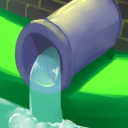

# Plumbum

A fork of [Indium](https://github.com/comp500/Indium) in an attempt to add FREX support to Sodium.

The name means the chemical element *Pb*, and also "plumbing", in reference to the rendering *pipe*line. Pretty genius, I know.

## Current State

**This mod is currently experimental and temporary.**

Custom FRAPI models render properly! Tested with Campanion, LambdaBetterGrass, and Continuity.

FREX extended features are technically implemented, but they are likely ignored. It hasn't been tested against real FREX implementation.

Still depends on FRAPI to differentiate vanilla baked models.
